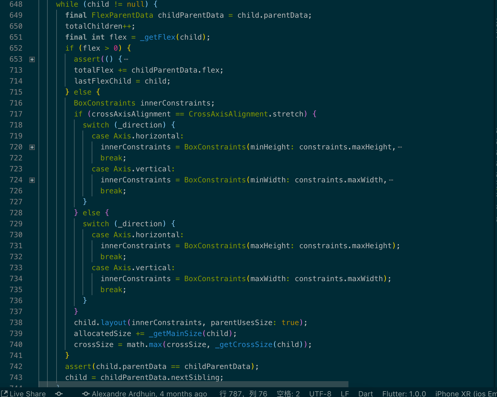
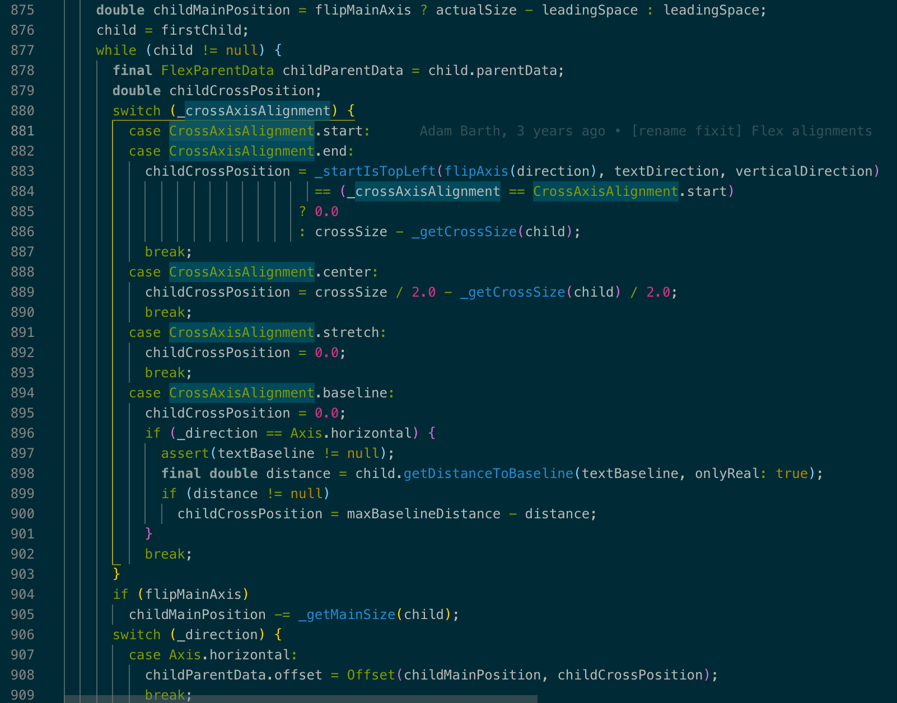

## Flex 源码解读

你能通过源码看见 Row 和 Column 都继承了 Flex ，布局具体的计算都在这个类中，我们可以通过源码 [https://github.com/flutter/flutter/blob/master/packages/flutter/lib/src/widgets/basic.dart#L3434](https://github.com/flutter/flutter/blob/master/packages/flutter/lib/src/widgets/basic.dart#L3434) 了解一下 Flex 是如何计算布局的。

Flex 构造函数

```dart
Flex({
  Key key,
  @required this.direction,
  this.mainAxisAlignment = MainAxisAlignment.start,
  this.mainAxisSize = MainAxisSize.max,
  this.crossAxisAlignment = CrossAxisAlignment.center,
  this.textDirection,
  this.verticalDirection = VerticalDirection.down,
  this.textBaseline,
  List<Widget> children = const <Widget>[],
})
```
基本上默认值的设计不管是 Row 还是 Column 都遵循了 Flex 的设计，唯一相比之下只有 this.direction 参数是多余出来的一个，通过源码的注释我们可以了解到它是用于设置轴的排列方向。

我们通过 RenderFlex 可以找到 [https://github.com/flutter/flutter/blob/master/packages/flutter/lib/src/rendering/flex.dart#L635](https://github.com/flutter/flutter/blob/master/packages/flutter/lib/src/rendering/flex.dart#L635) performLayout ，基本上我们都能猜测到一开始肯定会遍历 child，我把一些无用的代码折叠了：



通过逻辑可以分析出通过_getFlex计算出flex的值，flex 值存在然后去找到最后一个存在 flex 值的 child，对于不包含 flex 值的 child 则设置它们的对齐方向。

接下来从 `final double freeSpace = math.max(0.0, (canFlex ? maxMainSize : 0.0) - allocatedSize);` 开始去计算包含 flex 的空间大小，然后根据 CrossAxisAlignment.baseline 对 child 进行调整，这一步结束之后开始按照主轴对齐的方式将 child 进行调整。


最后一步按照交叉轴进行设置调整 child 。

